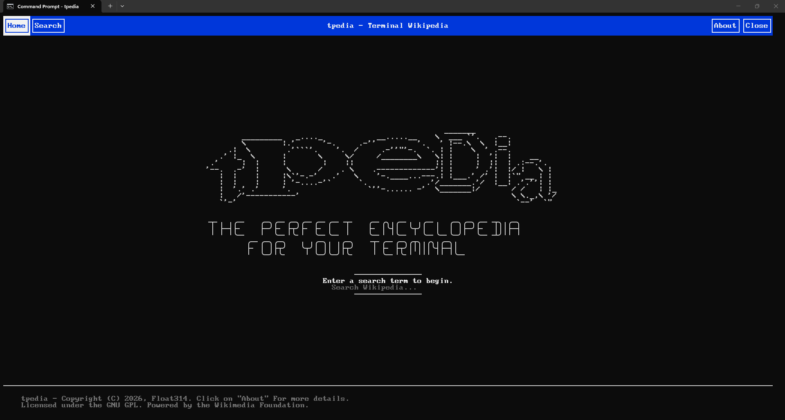

# tpedia - A Terminal Wikipedia for TTYs such as Arch and debian. 



A Simple Wikipedia page renderers for teens using Arch and debian TTY (dont judge me, these people are awesome)

tpedia brings Wikipedia articles directly to your TTY, making it easy to browse and search articles without leaving the terminal.

## Usage - 

Since it is a CLI tool, you may start with - 
type this in your terminal - 
```bash
tpedia
```

> \[!TIP]
> You can rename your binary to wpedia or wikipedia. But be careful if it conflicts with another package (Which can but idk)

## Why? 

Modern web browsers are great, but sometimes you just want to read documentation or learn about a topic from a terminal session.

tpedia aims to provide a simple and pleasant Wikipedia experience for TTY users, minimal Linux installations, and remote SSH environments.

## Dependencies

- matjson (lightweight json parsing)
- FTXUI (rendering in terminal)
- cpp-httplib

+ more

## Licensing 

Licensed under the GNU General Public License v3. 

Copyright (C) 2026, Float314 and contributors

This program is free software: you can redistribute it and/or modify
it under the terms of the GNU General Public License as published by
the Free Software Foundation, either version 3 of the License, or
(at your option) any later version.

This program is distributed in the hope that it will be useful,
but WITHOUT ANY WARRANTY; without even the implied warranty of
MERCHANTABILITY or FITNESS FOR A PARTICULAR PURPOSE.  See the
GNU General Public License for more details.

You should have received a copy of the GNU General Public License
along with this program.  If not, see <https://www.gnu.org/licenses/>.


