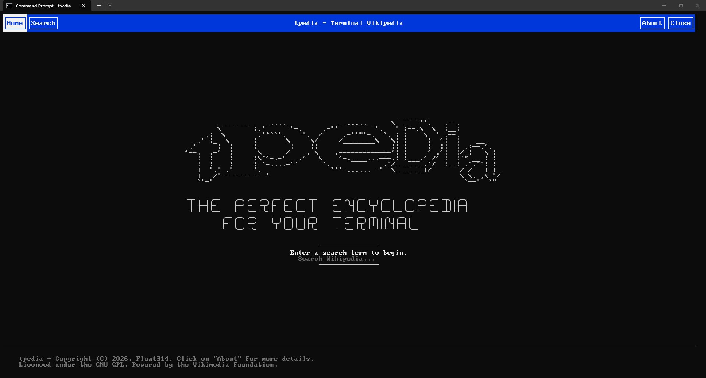

<div align="center">
  <h1>tpedia — Wikipedia In Your Terminal</h1>

  
  
  
  
</div><br>

<details>
  <summary>
    <b>View preview image</b>
  </summary>

  <br>
</details>

tpedia brings Wikipedia articles directly to your terminal screen, making it extremely easy to browse and find information.

## Usage 

Since it is just an executable, access tpedia via the command.

```bash
tpedia
```

> [!TIP]
> Rename the executable to "Wikipedia" or "wpedia" or whatever you wish to, to make it easy to access the executable
> aka, easing...

## Why? 

Modern web browsers are great, but sometimes you just want to read documentation or learn about a topic from a terminal session.

tpedia aims to provide a simple and pleasant Wikipedia experience for terminal users, minimal Linux installations, and remote SSH environments.

## Dependencies

- nlohmann/json (JSON parsing)
- FTXUI (rendering in terminal)
- cpp-httplib

\+ more

## Licensing 

Licensed under the GNU General Public License v3. 

Copyright (C) 2026, Float314 and contributors

This program is free software: you can redistribute it and/or modify
it under the terms of the GNU General Public License as published by
the Free Software Foundation, either version 3 of the License, or
(at your option) any later version.

This program is distributed in the hope that it will be useful,
but WITHOUT ANY WARRANTY; without even the implied warranty of
MERCHANTABILITY or FITNESS FOR A PARTICULAR PURPOSE.  See the
GNU General Public License for more details.

You should have received a copy of the GNU General Public License
along with this program.  If not, see <https://www.gnu.org/licenses/>.


> Logos provided by dotdotdot (._hello._hello.\_hello.\_ on Discord) - modified by me (Float314)
